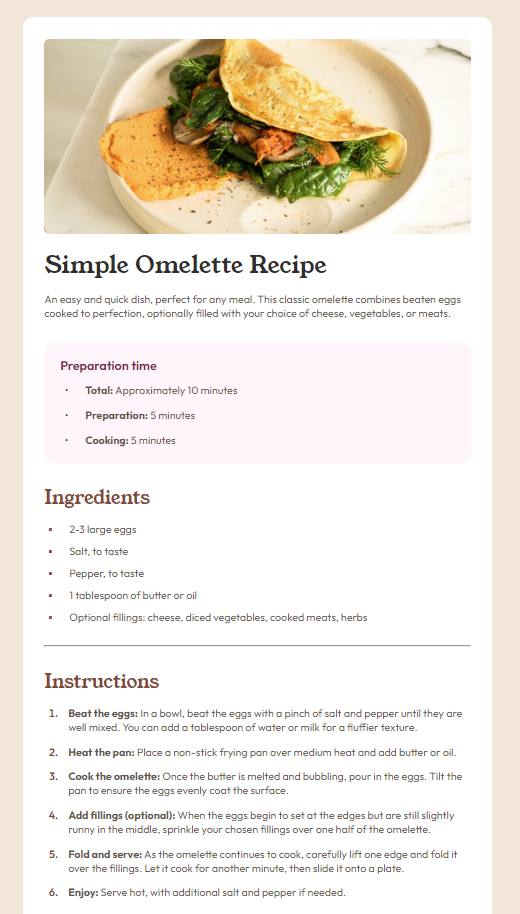
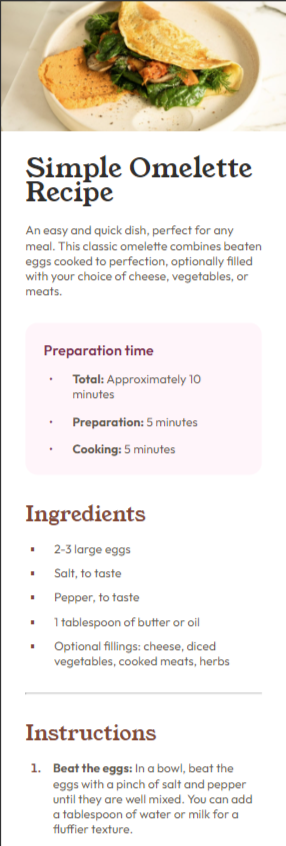

# Frontend Mentor - Recipe page solution

This is a solution to the [Recipe page challenge on Frontend Mentor](https://www.frontendmentor.io/challenges/recipe-page-KiTsR8QQKm). Frontend Mentor challenges help you improve your coding skills by building realistic projects.

## Table of contents

- [Overview](#overview)
  - [The challenge](#the-challenge)
  - [Screenshots](#screenshot)
  - [Links](#links)
- [My process](#my-process)
  - [Built with](#built-with)
  - [What I learned](#what-i-learned)
- [Author](#author)

**Note: Delete this note and update the table of contents based on what sections you keep.**

## Overview

### Screenshots

### Links

- Solution URL: https://github.com/vitchet/fm-recipepagemain
- Live Site URL: https://vitchet.github.io/fm-recipepagemain

## My process

### Built with

- Semantic HTML5 markup
- CSS variables
- CSS functions
- Flexbox

### What I learned

Making responsive design when the font size changes seperatly from the width of the components. Also learned how to work with list markers.

## Author

- Frontend Mentor - [@vitchet](https://www.frontendmentor.io/profile/vitchet)
